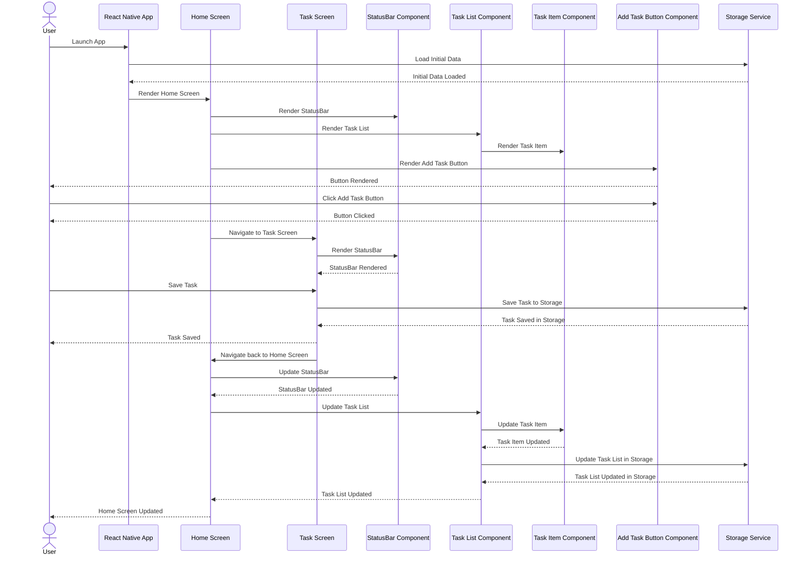

<h1 align="center">Todo | react-native-js</h1>

 
  

&#xa0;

## :dart: About ##

The ToDo List is a mobile application developed during the React Native formation of [Rocketseat](https://rocketseat.com.br/).

The application is a basic ToDo list.

## :rocket: Technologies ##

The following tools were used in this project:

- [React Native](https://reactnative.dev/)
- [TypeScript](https://www.typescriptlang.org/)
- [Styled Components](https://styled-components.com/)

## Diagram ##

Made by <a href="https://github.com/Adriano-Santtos" target="_blank">Adriano Santtos</a>

&#xa0;

<a href="#top">Back to top</a>
